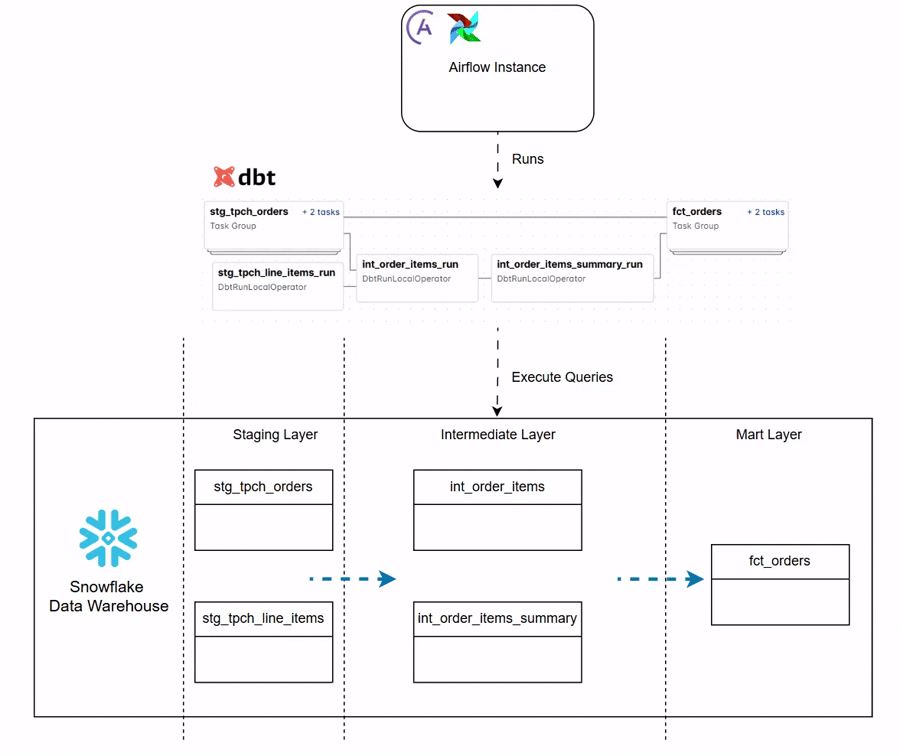

<p align="center">
  
</p>


## Setup Snowflake Environment

Execute following commands on snowflake upto clean up section:

```
-- create accounts
use role accountadmin;

create warehouse dbt_wh with warehouse_size='x-small';
create database if not exists dbt_db;
create role if not exists dbt_role;

show grants on warehouse dbt_wh;

grant role dbt_role to user <your snowflake username>;
grant usage on warehouse dbt_wh to role dbt_role;
grant all on database dbt_db to role dbt_role;

use role dbt_role;

create schema if not exists dbt_db.dbt_schema;
```

## Run Project Manually

Install dbt with snowflake connectors

Try running the following commands:
- dbt run
- dbt test

## Run Project Using Airflow

- install astro cli: https://www.astronomer.io/docs/astro/cli/install-cli/
- cd dbt-dag
- astro dev start
- goto Airflow UI
- configure snowflake connection in Airflow as follows:
```
Host: https://<replace>.snowflakecomputing.com
Login: <snowflake username>
Password: <snowflake password>
Port: 443
Schema: <snowflake schema you use>
```
- add following extra fields to connection:
```
{
  "account": "your account", // ex: jj95000.ap-south-1.aws
  "database": "dbt_db",
  "region": "your region", // ex: ap-south-1
  "warehouse": "dbt_wh",
  "role": "dbt_role"
}
```
- run the dbt-dag in Airflow UI

## Clean Up Snowflake Resources  

Execute following on snowflake:
```
-- clean up
use role accountadmin;

drop warehouse if exists dbt_wh;
drop database if exists dbt_db;
drop role if exists dbt_role;
```